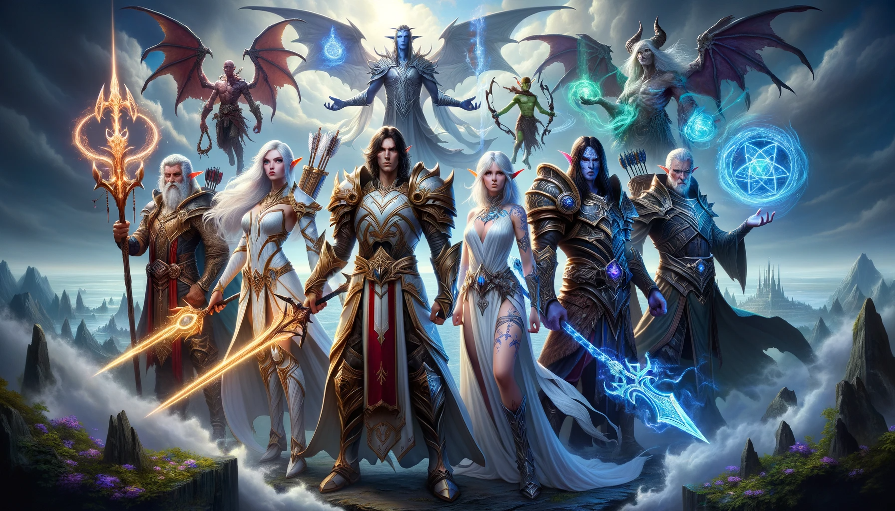

## История
_В далечния свят на Арканум, където магията тече във вените на всички същества, пет могъщи раси се състезават за доминация над континентите. Това е свят, в който величието се измерва не само със силата на меча, но и с мъдростта на древните заклинания. Войните тук не са просто сражения, те са битки между древни сили и волята за власт. Под покрова на вечната борба, всяка раса се стреми към своето собствено предназначение, водена от своите най-смели герои._

### Раси и Професии

#### 1. Хора (Паладини):
_Хората са благородни воини, които се отличават със своята стойност и чест. Като Паладини, те са защитници на слабите и борят се срещу тъмните сили, които заплашват света. Със своите свещени оръжия и заклинания, те са истински щит срещу злото._

#### 2. Елфи (Амазонки):
_Елфите са изящни и благородни същества, живеещи в сърцето на древните гори. Като Амазонки, те са несравними стрелци и гимнасти, които използват лъкове и стрели, за да поразят враговете си от разстояние._

#### 3. Орки (Варвари):
_Орките са сурови и яростни воини, известни със своите брутални бойни умения. Като Варвари, те владеят гигантски брадви и мечове, които използват, за да смачкат всякаква пречка на техния път._

#### 4. Дварфи (Некроманти):
_Дварфите са малки, но умни и здрави същества, които обитават планинските крепости. Като Некроманти, те имат връзка с магията на смъртта и могат да възкресяват покойници, за да служат на тяхната кауза._

#### 5. Кървави елфи (Вещици):
_Кървави елфи са тайнствени и загадъчни същества, които държат магията на стихиите в сърцето си. Като Вещици, те могат да призовават мощни елементали и да управляват силите на природата срещу техните врагове._

Тези професии и раси формират една богата и цветна вселена, в която героите могат да се сблъскат в епични битки за доминация над земите на Арканум. Всяка раса и професия носи уникални предимства и стратегии на бойното поле, като отваря врати за безброй тактически възможности в предстоящите сражения.

Съдбата на Арканум виси на косъм, като враждебните раси се подготвят за окончателната битка, която ще определи бъдещето на техния свят. Героите от различните раси трябва да обединят силите си, за да преодолеят тъмните сили, които се надигат от дълбините на земята. И тъй като зората на новата ера се наближава, войните на Арканум трябва да изберат дали да станат защитници на света или властелини на хаоса.

## Инструкции

### Задача 1: Създаване на базовия клас Character
#### Полета:

- **name** (String) - името на персонажа.
- **health** (int) - текущото здраве на персонажа.
- **power** (int) - силата на атаката на персонажа.
- **profession** (String) - професията на персонажа (например, Паладин, Варвар и т.н.).

#### Конструктор:
Конструктор, който приема параметрите по-горе като аргументи и ги задава на съответните полета.

#### Методи:
- **attack**(Character target) - абстрактен метод за атакуване на друг персонаж.
- **defend**() - абстрактен метод за защита от атака.

#### Getters и Setters за всички полета. Методи които взимат или задават стойността на всяко едно от полетата

### Задача 2: Създаване на класове за различните раси
За всяка раса (Хора, Елфи, Орки, Джуджета, Нежити) създайте отделни класове, които наследяват Character и предоставят реализация на абстрактните методи attack и defend.
- Хора - Тъй като са паладини те разполагат със средно ниво на щети, но могат да се възстановяват.
- Елфи - Тъй като са амазонки те са по-бързи и нанасят повече щети от Хората, могат също и да възстановяват малко кръв оно по-малко от Хората
- Орки - Тъй като са варвари те правят много щети, както и щетите върху тях са по-малки.
- Джуджета - Тъй като те са некроманти, правят малко щети, и възстановяват малко сила.
- Кървави елфи - Тъй като те са вещици, те нанасят средно ниво на щети, както и могат да се възстановяват.

### Задача 3: Създаване на класа Monster и някои монстри от Diablo 3

#### Полета:
- **name** (String) - името на монстъра.
- **health** (int) - текущото здраве на монстъра.
- **power** (int) - силата на атаката на монстъра.
- **type** (String) - типа на монстъра (например, Undead, Demon, Beast и т.н.).

#### Конструктор:
Конструктор, който приема параметрите по-горе като аргументи и ги задава на съответните полета.

#### Методи:
- **attack**(Character target) - метод за атакуване на персонаж.

#### Създайте няколко подкласа на Monster за различни монстри от Diablo 3, като например FallenShaman, SkeletonKing, Butcher и т.н., които имат различни характеристики и умения.

### Задача 4: Създаване на логика на боя
Клас **Battle** съдържа метод main, който създава инстанции на **Human** и **FallenShaman**``, и след това симулира битка между тях докато един от участниците не загине. Всеки рунд на битката се състои от атака от героя, последвана от атака от чудовището, ако то оцелее. Състоянието на битката се извежда на конзолата след всяка атака.

### Задача 5: Създаване на интерфейси
Създайте три интерфейса **Attackable**, **Healable** и **Defendable** които държат съответните методи. Обновете съответно **Character** класа като имплементира **Attackable** и **Defendable**, а класа **Healable** го имплементирайте единствено на персонажите които имат опция да се лекуват.

### Задача 6: Създаване на клас Game
Целта на Game класа е да предложи основна структура на играта, като позволява на играча да създаде герой и да се бие с поредица от чудовища. Играта следва следните стъпки:

1. Играчът създава герой в началото на играта.
1. Играчът има възможността да създава списък от чудовища, с които да се бие.
1. Играчът стартира битката, като героят влиза в бой с първото чудовище от списъка.
1. След края на всяка битка, играчът има възможността да използва магия за възстановяване на силата на героя или да изчака 5 секунди, за да възстанови силата на героя автоматично.
1. След възстановяването на силата, героят влиза в следващата битка със следващото чудовище от списъка, докато всички чудовища в списъка не са били победени или героят не е загинал.

#### Създаване на класа Game

##### Дефиниране на променливи:
- Добавете частна променлива **hero** от тип **Character**.
- Добавете частна променлива **monsters** от тип **Queue<Monster>** за да съхранявате чудовищата във FIFO ред.

##### Метод за създаване на герой:
Създайте метод **createHero**, който приема name и profession като аргументи и създава нов герой, който се присвоява на променливата hero.

##### Метод за добавяне на чудовище:
Създайте метод **addMonster**, който приема monster като аргумент и го добавя в опашката monsters.

##### Метод за стартиране на битка:
Създайте метод **startBattle**, който взема първото чудовище от опашката monsters и стартира битка между героя и чудовището.
Ако героят победи, потребителят трябва да изчака 5 секунди за автоматично възстановяване преди следващата битка.

##### Метод за възстановяване на силата:
Създайте метод **recover**, който възстановява силата на героя, като трябва да се изчака 5 секунди за автоматично възстановяване.

#### BONUS
##### Метод за създаване на случайно чудовище:
Създайте метод **createRandomMonster**, който създава и връща ново случайно генерирано чудовище.

#### СТАРТИРАЙТЕ ИГРАТА
